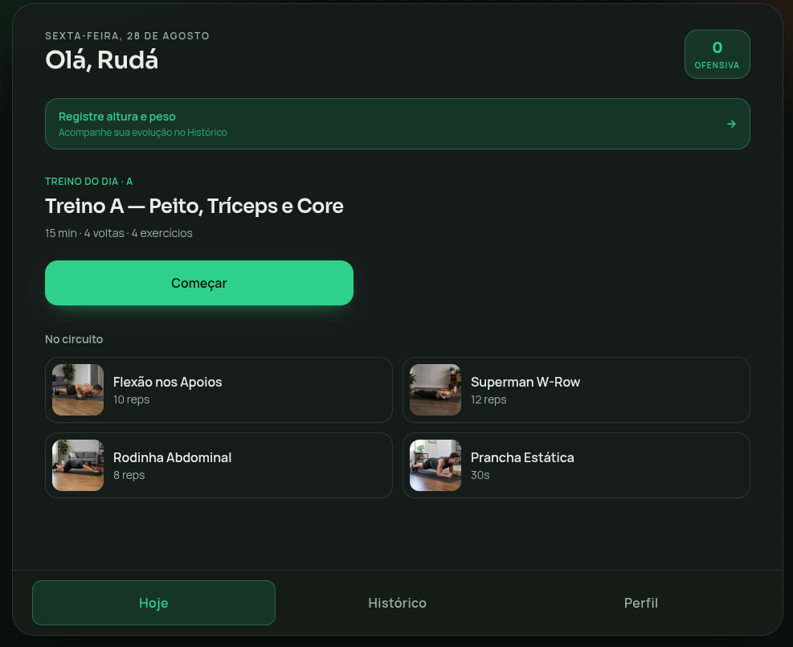
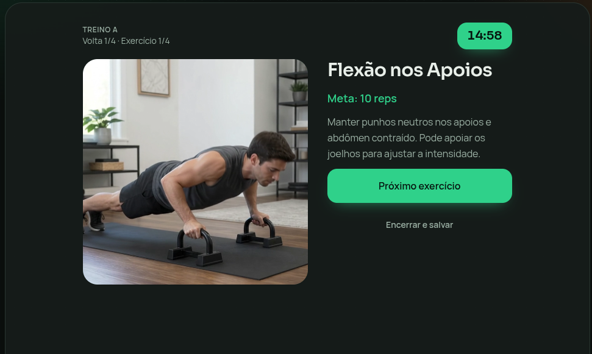
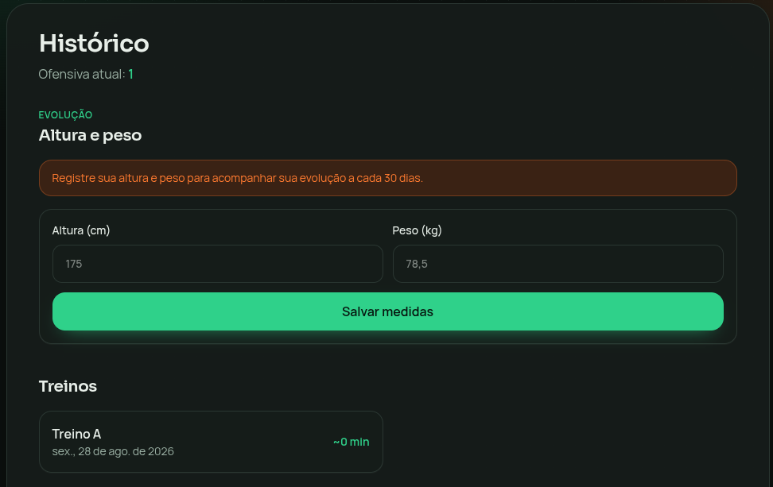

# FitFlow Home

Treinos rápidos de **15 minutos** em casa — peito, postura e core.  
Ciclo **dia sim / dia não** (Treinos A e B), com vídeos de demonstração, histórico, evolução corporal e tema claro/escuro.

**App:** [fitflow.davicosystems.ia.br](https://fitflow.davicosystems.ia.br)  
Alias Vercel: [fitflow-home-pink.vercel.app](https://fitflow-home-pink.vercel.app)

Próximos passos (backlog, não o produto de hoje): [ROADMAP.md](ROADMAP.md)

---

## Screenshots

### Hoje — treino do dia

<p align="center">
  
</p>

### Sessão de treino

<p align="center">
  
</p>

### Histórico — evolução e treinos

<p align="center">
  
</p>

---

## O que é

O **FitFlow Home** é um app de treino focado em consistência, não em volume:

- Circuito de **15 min** · **4 voltas** · descanso entre voltas
- **Aquecimento** de 1 min (gato-vaca) antes do circuito — dá para pular
- Alternância **Treino A** (peito, tríceps, core) e **Treino B** (costas, postura, lombar)
- Dias de descanso com dica de caminhada — e opção de **treinar mesmo assim**
- Guias visuais com **vídeo + poster** por exercício
- Ofensiva (streak), histórico, altura/peso com gráfico a cada 30 dias
- Tema **claro / escuro** e instalável como **PWA**

---

## Stack

| Camada | Tecnologia |
|--------|------------|
| Frontend | Next.js 16 (App Router) · React 19 · TypeScript · Tailwind CSS 4 |
| Backend | Supabase (Auth, Postgres, RLS) |
| Deploy | Vercel |
| Idioma | PT-BR |

---

## Funcionalidades

- Auth por **e-mail + senha** (criar conta, login, esqueci senha, trocar senha no perfil)
- Tela **Hoje** com treino do dia ou descanso ativo
- **Aquecimento** de 60s (gato-vaca) antes do circuito A/B, com opção de pular
- Sessão `/treino/A` e `/treino/B` com timer global e progresso
- **Histórico** de treinos + ofensiva
- **Altura e peso** com lembrete a cada 30 dias e gráfico de evolução
- **Resetar dados** (começar de novo) no Histórico
- **Tema claro/escuro** no Perfil
- **Ciclo de treino** no Perfil: todo dia, dia sim/dia não, ou dias da semana
- Layout responsivo (mobile/PWA + desktop)
- **PWA** instalável (manifest + service worker)

---

## Setup local

### 1. Ambiente

```bash
cp .env.example .env.local
```

Preencha com as chaves do Supabase (Project Settings → API):

```env
NEXT_PUBLIC_SUPABASE_URL=https://xxxx.supabase.co
NEXT_PUBLIC_SUPABASE_ANON_KEY=eyJ...
```

### 2. Banco

No Supabase → **SQL Editor**, rode as migrations em ordem:

1. [`supabase/migrations/001_initial.sql`](supabase/migrations/001_initial.sql) — schema, RLS, seed A/B  
2. [`supabase/migrations/002_body_metrics.sql`](supabase/migrations/002_body_metrics.sql) — altura/peso  
3. [`supabase/migrations/003_body_metrics_delete.sql`](supabase/migrations/003_body_metrics_delete.sql) — delete para reset  
4. [`supabase/migrations/004_security_hardening.sql`](supabase/migrations/004_security_hardening.sql) — hardening (storage, checks)  
5. [`supabase/migrations/005_schedule_modes.sql`](supabase/migrations/005_schedule_modes.sql) — ciclo: todo dia / dia sim-não / dias da semana  
6. [`supabase/migrations/006_warmup.sql`](supabase/migrations/006_warmup.sql) — aquecimento gato-vaca 

### 3. Auth

Em **Authentication → URL Configuration**:

- **Site URL:** `https://fitflow.davicosystems.ia.br`
- Redirects:
  - `https://fitflow.davicosystems.ia.br/**`
  - `https://fitflow.davicosystems.ia.br/auth/callback`
  - `https://fitflow-home-pink.vercel.app/**`
  - `http://localhost:3000/**`

O fluxo de redefinir senha usa PKCE em `/auth/callback?next=/redefinir-senha`.

### 4. Rodar

```bash
npm install
npm run dev
```

Abra [http://localhost:3000](http://localhost:3000).

---

## Rotas

| Rota | Função |
|------|--------|
| `/` | Landing |
| `/login`, `/signup` | Entrar / criar conta |
| `/esqueci-senha` | Pedir e-mail para redefinir senha |
| `/redefinir-senha` | Nova senha (após o link do e-mail) |
| `/auth/callback` | Callback PKCE do Supabase Auth |
| `/hoje` | Treino do dia ou descanso |
| `/treino/A`, `/treino/B` | Sessão com cronômetro |
| `/descanso` | Dica de caminhada |
| `/historico` | Logs, medidas, reset |
| `/perfil` | Nome, ciclo, tema, trocar senha, logout |

---

## Ciclo dia sim / dia não

A partir de `profiles.start_date` (dia 0) e `schedule_mode`:

| Modo | Quando treina |
|------|----------------|
| `alternate` (padrão) | Offset par = treino, ímpar = descanso |
| `everyday` | Todos os dias |
| `weekdays` | Dias em `schedule_weekdays` (0=Dom … 6=Sáb) |

Treinos A/B alternam só nos **dias programados**. Nos outros, a tela Hoje mostra descanso — dá para treinar mesmo assim. Dias de descanso **não quebram** a ofensiva.

---

## Mídia dos exercícios

Arquivos em `public/exercises/`:

- `{slug}.webp` — poster  
- `{slug}.mp4` — vídeo de demonstração  

Inclui `aquecimento-gato-vaca` (antes do circuito A/B).

URLs no banco apontam para `/exercises/{slug}.webp` e `/exercises/{slug}.mp4`.

---

## Deploy (Vercel)

1. Conecte o repositório na Vercel  
2. Configure as mesmas env vars  
3. Atualize Site URL e Redirect URLs no Supabase (domínio custom + `.vercel.app` + localhost)  
4. Deploy  

**Produção:** https://fitflow.davicosystems.ia.br  

Não exponha a `service_role` no frontend — só a `anon` key no client.

Ícone da tela inicial (PWA): o Android costuma cachear. Depois de trocar o ícone, remover o atalho e instalar de novo.

---

## Scripts

```bash
npm run dev      # desenvolvimento
npm run build    # build de produção
npm run start    # servir build
npm run lint     # ESLint
npm run smoke    # smoke test do ciclo dia sim/não
```

---

## Estrutura

```
src/
  app/           # rotas (App Router)
  components/    # UI (sessão, métricas, tema…)
  lib/           # day-plan, streak, supabase, types
public/
  exercises/     # webp + mp4 dos exercícios
  icons/         # ícones PWA
supabase/
  migrations/    # SQL schema + seed
docs/
  screenshots/   # imagens deste README
ROADMAP.md       # ideias futuras (não o produto atual)
```

---

## Licença

Projeto privado / uso pessoal — ajuste conforme a necessidade do repositório.
